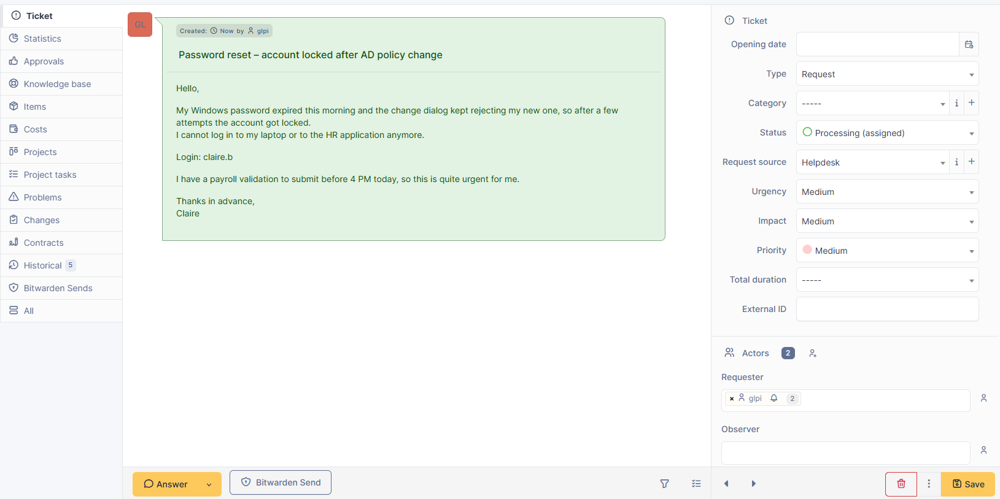
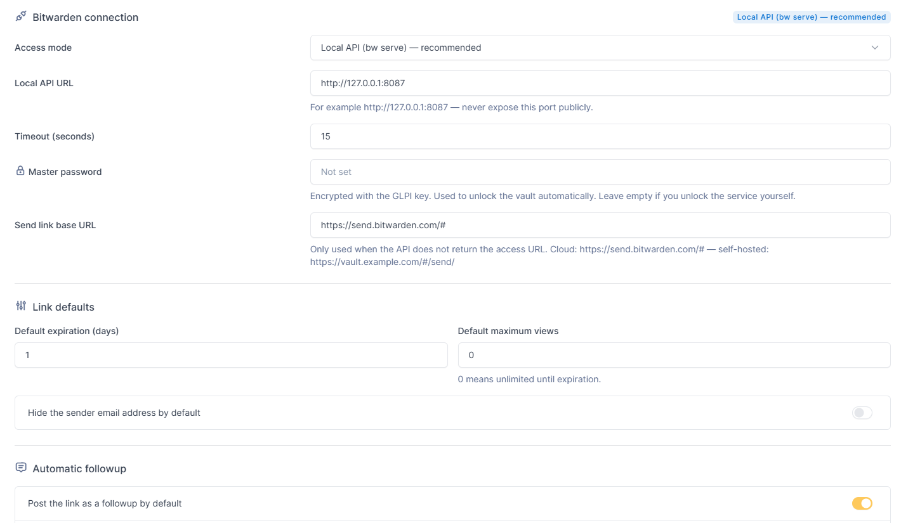

# Bitwarden Send for GLPI

Share a secret on a ticket, change, or problem — a password, a key, a token — through
a **Bitwarden Send** link, without ever typing it into the ticket itself. One click
from the ITIL timeline, right next to Answer/Task/Solution/Document/Validation.

The plugin creates the Send, posts the link as a followup, and keeps track of it on
its own tab — expiration, remaining views, and a one-click revoke — so the secret
never has to live in GLPI's own database as plain text.

## Features

- **Timeline integration** — a "Bitwarden Send" entry next to Answer/Task/Solution,
  plus a dedicated "Bitwarden Sends" tab on Ticket, Change and Problem.
- **Full control over each link** — expiration date, maximum number of views, an
  optional password, and hiding the sender's email address.
- **Rich text followup** — the same editor as a normal GLPI followup, with a live
  preview as the expiration and view count are filled in.
- **Your own wording** — a configurable default template, or any of GLPI's own
  followup templates, picked at creation time.
- **Revoke anytime** — from the tab, with an "Expired" status shown automatically
  once the deadline passes, even if nobody revoked it by hand.
- **Automatic cleanup** — old revoked or expired entries are deleted on a schedule
  you control.
- **Two ways to talk to Bitwarden** — the official `bw` CLI (local API or direct
  invocation), or a native PHP driver with no external binary at all, for hosts
  without shell access such as GLPI Cloud.
- **Dedicated rights and encrypted secrets** — a specific right for the plugin's
  actions, and every credential stored encrypted with GLPI's own key.

## Documentation

This page is a feature overview. For installation, server prerequisites,
configuration reference and troubleshooting, see:

- [docs/README_TECHNICAL.md](docs/README_TECHNICAL.md) (English)
- [docs/README_TECHNIQUE.md](docs/README_TECHNIQUE.md) (Français)

Release history: see [CHANGELOG.md](CHANGELOG.md).

## License

GPLv3+ — see [LICENSE](LICENSE).
